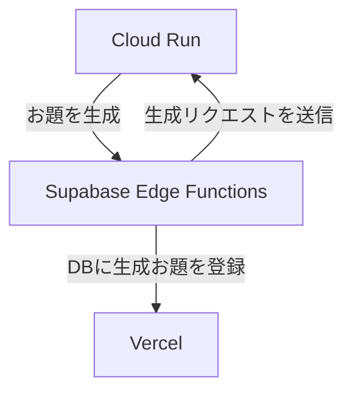
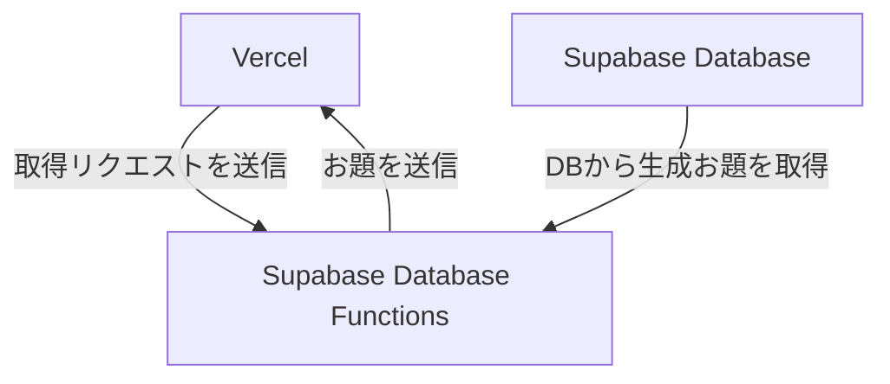

# ogirin

## リンク

- [大喜林](https://ogirin.vercel.app/)

## これは何

- 大喜利のお題を生成AIを使って、作成してくれるサービス「大喜林」

## 構成図
### お題生成

### お題取得

## 詳細

### Cloud Run
- FastAPIで実装
- LLMによるお題生成を実行

### Supabase Edge Functions
- Cloud Runにお題生成リクエストを定期送信
- Cloud RunからのレスポンスをSupabase Databaseに登録

### Supabase Database Functions
- Vercelからリクエストを受け取り、Supabase Databaseからお題を取得
- お題をVercelに返却

### Supabase Database
- PostgreSQL Databaseでお題を管理
- 認証機能は随時実装予定

### Vercel
- Next.jsで実装
- お題の残り件数が足りなくなった時点でEdge Functionsを呼び出し
